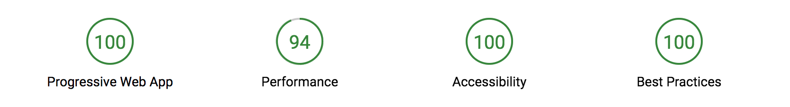

# Enfo World News
An experiment trying to create some kind of a PWA using plain vanilla javascript. The app loads a list of news articles
from an external API and renders the result.

[Demo](https://enfoworldnews.com/)

* Tested in Chrome, Firefox and Edge.
* Uses service-worker to cache static content.
* Lazy loading images using Intersection Observer.

### Lighthouse score
Since some images are loaded from an external source I can't get performance much higher, unfortunately.  

### Development setup
There are a few (optional) npm development dependencies, just for eslint and to create a local http dev server. 

Run `npm install` to install the dependencies.

Start the http server with `npm start`.

### Future improvements
* Inline critical css styles
* Uglify css and js
* Versioning of static files for service worker to invalidate old cache
* Gulp build process
* Auto-complete suggestions for the search field
* A better search field expansion toggling